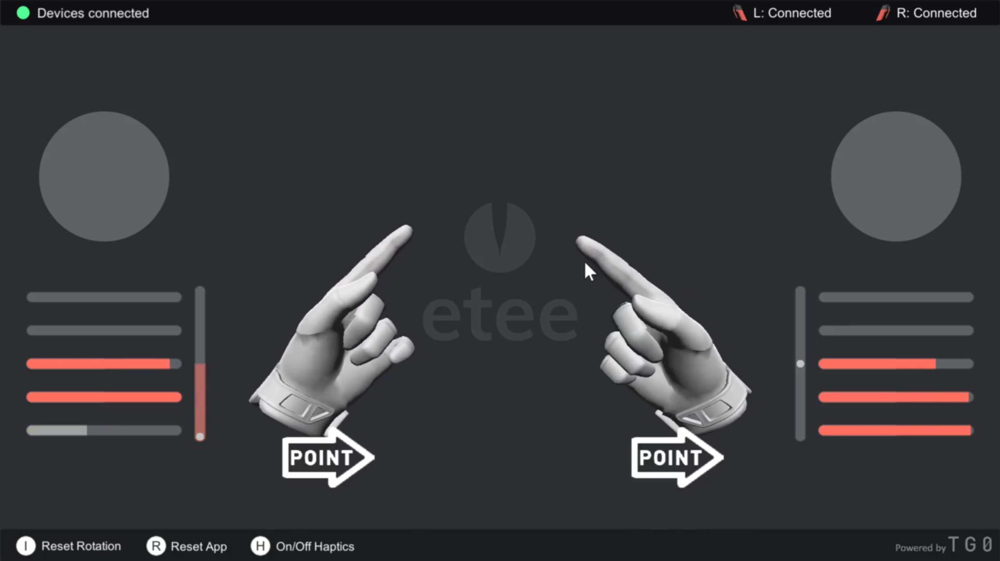

<!-- README file in MD for the etee OpenVR Driver repository-->

<!--
*** Attribution and thanks: README template adapted from Othneil Drew's example, available at:
*** https://github.com/othneildrew/Best-README-Template
-->

<!-- PROJECT LOGO -->
 

   Executable build files for the eteeDemo (Hands) app.

<!-- SHIELDS FOR SOCIALS -->

    
    
    

<!-- ABOUT THE PROJECT -->
## About the Project

This repository contains the build or executable files for the Unity-based etee demo app, showcasing 3D virtual hand motion and rotation.

  
   
  <em>Screenshot of eteeDemo app.</em>

<!-- GETTING STARTED -->
## Getting Started

From this Github repository, download the zip file with the desired version.

Then, unzip the file and follow the instructions shown in the [Instructions of Use - eteeDemo](./Instructions%20of%20Use%20-%20eteeDemo.pdf) file.

<!-- MARKDOWN LINKS & IMAGES -->
<!-- https://www.markdownguide.org/basic-syntax/#reference-style-links -->
[url-openvr-repo]: https://github.com/ValveSoftware/openvr
[url-steamvr]: https://store.steampowered.com/app/250820/SteamVR/
[url-tg0-website]: https://tg0.co.uk/
[url-eteexr-website]: https://eteexr.com/
[url-eteexr-svr-qsg]: https://eteexr.com/pages/eteecontroller-steamvr-guide
[url-eteeconnect]: https://store.steampowered.com/app/1590110/eteeConnect/
[url-issues-tab]: https://github.com/eteeXR/etee-OpenVR-Driver/issues
[url-semantic-type-prefixes-1]: https://dev.to/puritanic/how-are-you-writing-a-commit-message-1ih7
[url-semantic-type-prefixes-2]: http://karma-runner.github.io/1.0/dev/git-commit-msg.html
